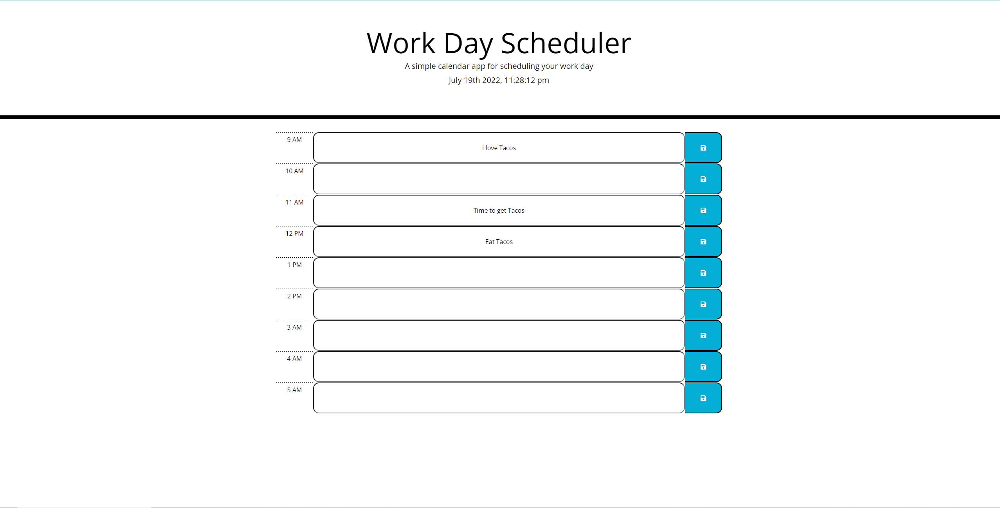

# Scheduler

Work Day Scheduler

URL of deployed page: https://luan-pham.github.io/Scheduler/

Each event enter to a timeblock is saved upon clicking button on right side of each block.

Event is saved to localstorage for display in the future.

Each timeblock is color coded to determine if it is in the future, present or past. (Work in Progress)

